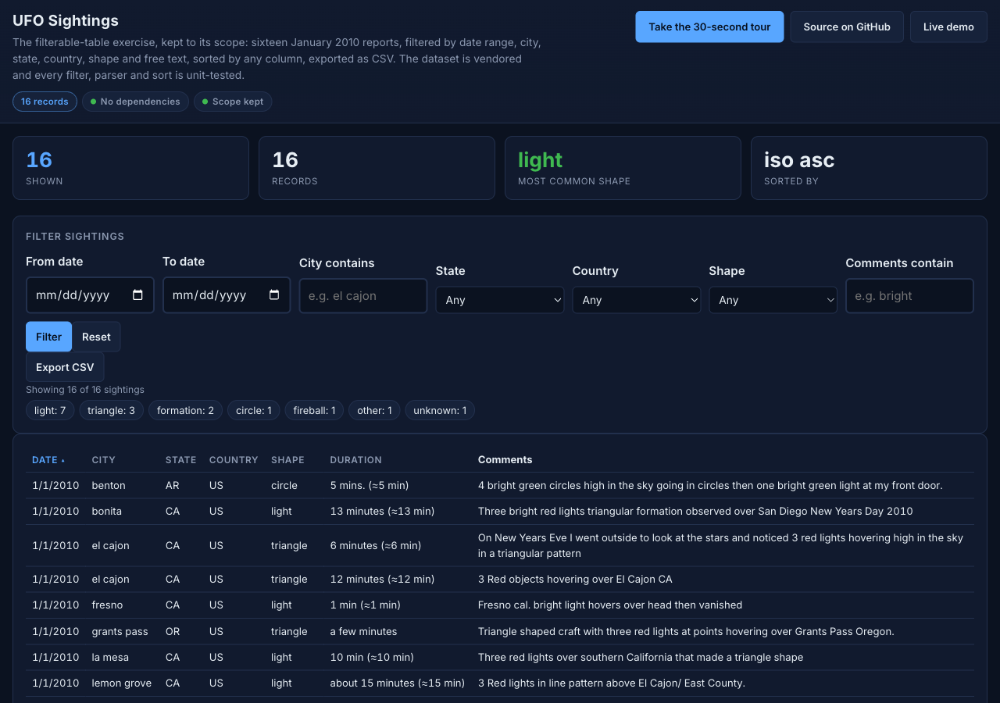
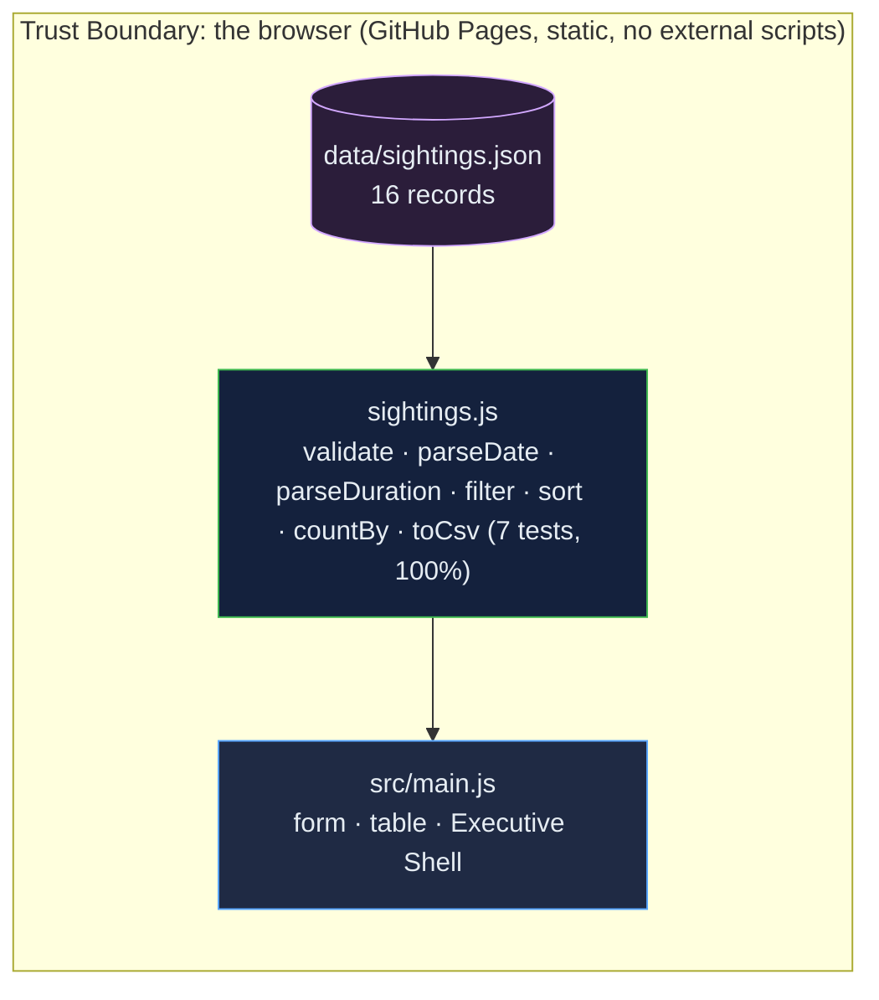

# UFO Sightings: the filterable-table exercise, kept to scope, with honest copy and tested filters

[](https://github.com/Freddricklogan/UFO-Sightings/actions/workflows/deploy.yml)
[](#5-getting-started--verification)
[](https://github.com/Freddricklogan/UFO-Sightings/actions/workflows/codeql.yml)
[](LICENSE)
[](https://freddricklogan.github.io/UFO-Sightings/)

## 1. Executive Summary & Business Impact

**Problem statement.** The UFO Sightings exercise is a table with five
text filters. The previous build described "thousands of recorded UFO
sightings" over a file of sixteen, matched dates only as exact strings
against a text box, treated durations such as "2-3 seconds" as opaque
text, could not sort, and pulled D3 and Bootstrap from CDNs to do it
(`AUDIT.md`).

**Solution & value delivered.** The same table, kept to scope, with the
copy corrected to sixteen January 2010 reports; a date range, substring
matching on city and comments, selects for state, country and shape,
all case-insensitive; durations parsed into minutes with an approximate
flag so the column sorts; sorting on every column with `aria-sort`; a
live result count; CSV export of the filtered rows; no external
scripts; and the logic in one tested module.

**[→ Read the full case study](docs/CASE_STUDY.md)**



## 2. Demonstrated Competencies & Technical Skills

- **Data Visualization & Filtering** — multi-criteria filtering with
  clear semantics, sortable tables with accessible headers, free-text
  duration parsing, CSV export.
- **Engineering Practice** — vendored and validated data, zero external
  scripts, strict CSP, 100 % statement coverage of the logic module,
  copy that matches the data.

## 3. System Architecture & Data Flow



## 4. Technical Highlights & Engineering Decisions

### ADR-1 — Filters with stated semantics

**Context.** Exact-string matching on free text made most reasonable
inputs return nothing.

**Decision.** Dates are a from/to range on native date inputs; city and
comments match on substring; state, country and shape are selects built
from the data; all comparisons are case-insensitive. The count reports
matches and says what to do when there are none.

**Consequence.** `tests/sightings.test.js` pins each rule — `ligh` does
not match `light`, `el` does match `el cajon`, `CA` equals `ca`.

### ADR-2 — Parse durations rather than display them

**Context.** The duration column mixed "5 mins.", "2-3 seconds", "about
15 minutes" and "30 minuets".

**Decision.** `parseDuration` reads a number or a range midpoint and a
unit, returns minutes and an `approximate` flag, and the table shows
the original text with the parsed value; rows that cannot be parsed
sort last.

**Consequence.** The column sorts numerically, and one row ("a few
minutes") is honestly unparsed rather than silently zero.

### ADR-3 — Say sixteen

**Context.** The description claimed thousands of records.

**Decision.** The page, the shell badge, the README and the data file
all state the count and origin.

**Consequence.** Nothing on the page promises more than the file holds.

## 5. Getting Started & Verification

**Prerequisites.** Node 22 LTS. No build step; the page is served from
the repository root.

```bash
git clone https://github.com/Freddricklogan/UFO-Sightings.git
cd UFO-Sightings
npm ci
npm run lint && npm run validate && npm run coverage
npx serve .    # open http://localhost:3000
```

**Verification — the numbers this repository actually produced:**

```bash
npm run coverage   # 7 passed / 7; All files 100% stmts, 98.75% branches
npm run lint       # 0 problems
npm run validate   # html-validate index.html: clean
```

| Check | Result |
| --- | --- |
| Unit tests (Vitest) | **7 passed / 7** |
| Coverage (logic module) | **100%** statements, **98.75%** branches (`main.js`, `ui.js` covered by the browser smoke test) |
| ESLint, html-validate | clean |
| Dataset | 16 records, validator reports 0 problems; 7 "light", 3 "triangle", 2 "formation"; 1 duration unparseable |
| Headless Chrome smoke | **0 console errors**; shape "light" → 7 of 16; plus city "EL" → 1 (el cajon); reset → 16; duration sorted descending puts "30 minuets (≈30 min)" first and "a few minutes" last with `aria-sort="descending"`; from 2010-01-02 → 0 with guidance; three tour steps; no horizontal scroll at 1280 or 400 px |

## 6. Live Demo & Production Showcase

**<https://freddricklogan.github.io/UFO-Sightings/>**

**30-second guided walkthrough.** Press **Take the 30-second tour**: it
filters by shape, sorts by parsed duration, and points at the CSV
export.
